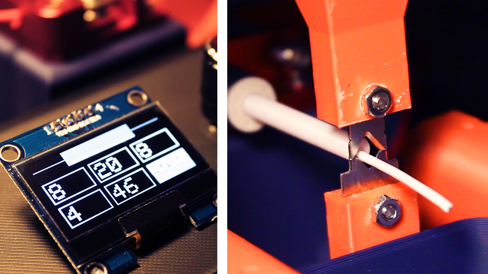
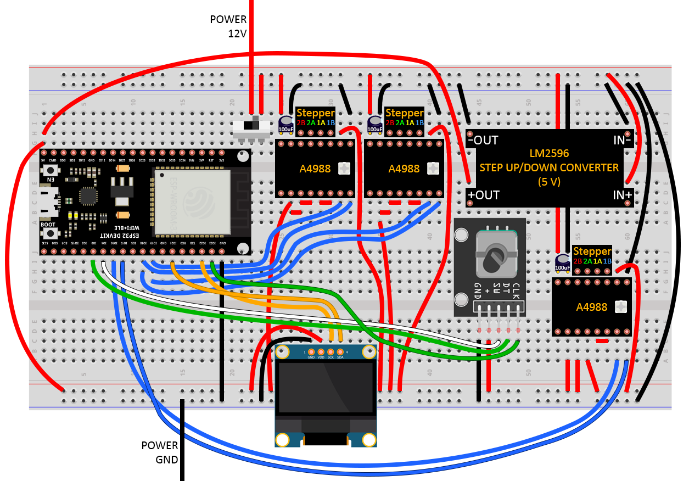

# Automatic Wire Stripper and Cutter

A 3D printed automatic wire stripper and cutter. You simply choose your measurements on a screen, press a button, and it does it all for you. It will strip the wire and cut the wire depending on the options you chose.

There is a [video](https://youtu.be/pbuzLy1ktKM) associated with this repository/project, I highly recommend watching it before using this repo.

# Arduino

You can find the Arduino sketch in the `/AutoWireCutterStripper` directory.

- Make sure that the i2c address (`#define i2c_Address 0x3c`), corresponds to your OLED display i2c address, which you will find in the datasheet of your OLED display.

## Libraries needed

All these libraries can be easily installed using the Arduino IDE library manager.

- `Stepper` by Arduino.
- `Encoder` by Paul Stoffregen.
- `Adafruit GFX Library` by Adafruit.
- `Adafruit SH110X` by Adafruit.

# Components

- [ESP32](https://www.amazon.co.uk/dp/B071P98VTG?ref_=cm_sw_r_cp_ud_dp_DDGQ5R6XVBCC7JBB04K3), for the micro-controller.
- [12V 5A](https://www.amazon.co.uk/dp/B08GS7WM1Z?ref_=cm_sw_r_cp_ud_dp_QJHEPBDAWDEDX3JDRTGF) power supply.
- [LM2596](https://www.amazon.co.uk/dp/B077VW4BTY?ref_=cm_sw_r_cp_ud_dp_1D9J5V36PP85VKDA2V49) or any step down converter, to convert 12V to 5V for the ESP32.
- [Nema 17 stepper motor](https://www.amazon.co.uk/dp/B07K3Y5314?ref_=cm_sw_r_cp_ud_dp_RZY0XHJFQ6YN1HZXPX8X) (x3), two for the linear motion, one for the extruder.
- [A4988 stepper motor driver](https://www.amazon.co.uk/dp/B06Y23YXD5?ref_=cm_sw_r_cp_ud_dp_1REVFHTFN5E2CMNSRTTB) (x3), to drive and control the stepper motors.
- 100uF capacitor (x3), for the 12V power pins for each of the A4988 drivers.
- [OLED display](https://www.amazon.co.uk/dp/B078J78R45?ref_=cm_sw_r_cp_ud_dp_1XXX2M7YAQJN5G6AKV93), 1.3inch, 128x64.
- [Rotary encoder](https://www.amazon.co.uk/dp/B07CMSHWV6?ref_=cm_sw_r_cp_ud_dp_Y2VC355RTHHYRKTZ436B) with button.
- [Power switch](https://www.amazon.co.uk/dp/B01N2U8PK0?ref_=cm_sw_r_cp_ud_dp_K4GSW1GDA4G8QCXJWPE4), to turn on and off.
- [3D printer filament extruder](https://www.amazon.co.uk/dp/B07TWK8FRN?ref_=cm_sw_r_cp_ud_dp_FXQD93NZKYG9VA0Q6P3F), for the wire feeder.
- [D8mm L100mm lead screw](https://www.amazon.co.uk/dp/B07QWKG317?ref_=cm_sw_r_cp_ud_dp_JMAC4EKE28W5Z3GSZSN8) (x2), for the linear motion.
- [D8mm lead screw nut](https://www.amazon.co.uk/dp/B07QWKG317?ref_=cm_sw_r_cp_ud_dp_JMAC4EKE28W5Z3GSZSN8) (x2), to attach the top blade housing to the lead screws.
- [5x8mm rigid shaft coupler](https://www.amazon.co.uk/dp/B096G1GZH5?ref_=cm_sw_r_cp_ud_dp_VWE1T2SQZQB0X13TQ1F7) (x2), to attach the lead screws to the stepper motors.
- [10mm magnets](https://www.amazon.co.uk/dp/B08FSTRRDR?ref_=cm_sw_r_cp_ud_dp_13WEC590XVADQKN2RJ0W) (x2), to attach the container.
- [KNIPEX V-blades](https://www.amazon.co.uk/dp/B00161GBDW?ref_=cm_sw_r_cp_ud_dp_S63KK1ZZ8DPRHWMBEFJC), to cut and strip the wires.

# Wiring

# 3D printing

Please refer to the `/3d_printing` directory.

# Assembly layout
This is the layout of the components on the board. Use this only for reference on roughly where you should fix the components to the board. I don't suggest using this for exact measurements as you should position the components where it is appropriate for your version of the project.

[Layout PDF](./assembly_layout.pdf).
